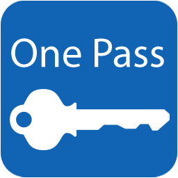
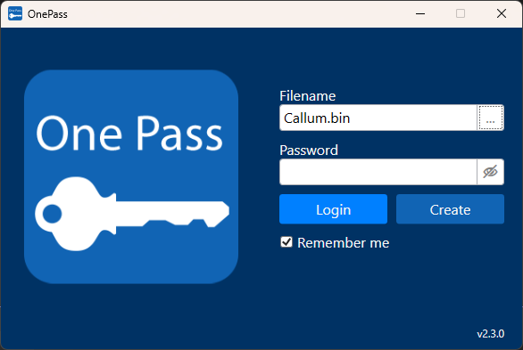
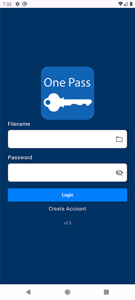

# OnePass

OnePass is an offline password manager for Windows and Android. Your accounts are stored locally in an encrypted vault file, giving you control over where your data is kept.

The same vault can be transferred between Windows and Android, with no online account or cloud service required.



## Features

- Encrypted, local vault storage
- Windows and Android applications
- Searchable accounts and favourites
- Built-in password generator
- Password history
- One-click credential copying
- Vault transfer and merging between devices
- JSON export on Windows

## Screenshots

| Windows | Android |
| :---: | :---: |
|   |  |

## Requirements

### Windows

- Windows
- [.NET 8 SDK](https://dotnet.microsoft.com/download/dotnet/8.0)
- Visual Studio with the **.NET desktop development** workload

### Android

- Android Studio
- Android SDK 37
- A device or emulator running Android 9 (API 28) or later

## Building

### Windows

Open `OnePass.sln` in Visual Studio, select `OnePass.WPF` as the startup project, and build or run the solution.

Alternatively, build from the command line:

```powershell
dotnet build OnePass.sln
```

### Android

Open the `Android` directory in Android Studio, allow Gradle to finish syncing, and run the `app` configuration.

Alternatively, build from the command line:

```powershell
cd Android
.\gradlew.bat assembleDebug
```
